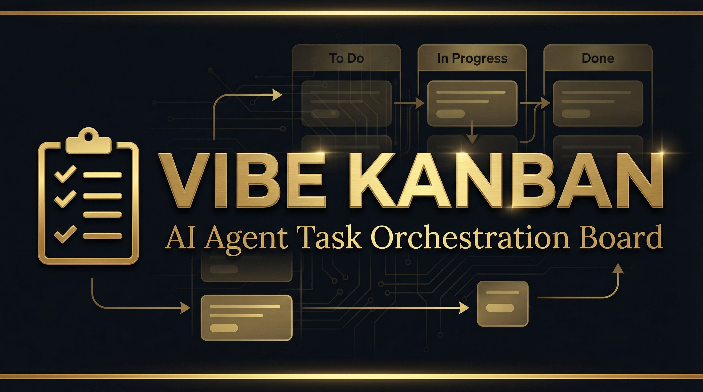

<!-- HEADER BANNER -->
<div align="center">
  
</div>

<div align="center">

[](https://www.rust-lang.org/)
[](LICENSE)
[](https://react.dev/)
[](https://github.com/Alexi5000/vibe-kanban)

</div>

> **Vibe Kanban is an open-source Kanban board purpose-built for managing AI coding agents.** Track tasks across multiple AI agents (Claude Code, Cursor, Copilot, etc.) in a single visual board. See what each agent is working on, what's queued, and what's done — in real time.

---

## Why Vibe Kanban

When you're running multiple AI coding agents simultaneously, you need a command center. Vibe Kanban gives you a visual overview of every agent's workload, task status, and progress — replacing the chaos of multiple terminal windows with a clean, organized board.

## Key Features

| Feature | Description |
|---------|-------------|
| **Multi-Agent Tracking** | Monitor Claude Code, Cursor, Copilot, and custom agents from one board |
| **Real-Time Updates** | Live task status changes as agents complete work |
| **Drag-and-Drop** | Intuitive Kanban interface for task prioritization and assignment |
| **Agent Profiles** | Configure and manage different AI agent capabilities |
| **Task Dependencies** | Define task relationships and execution order |
| **Built in Rust** | Blazing fast backend with minimal resource footprint |

## Quick Start

```bash
# Clone the repository
git clone https://github.com/Alexi5000/vibe-kanban.git
cd vibe-kanban

# Build the Rust backend
cargo build --release

# Install frontend dependencies
cd frontend && npm install && cd ..

# Start the application
cargo run --release
```

Visit `http://localhost:8080` to access your local Vibe Kanban instance.

## Technology Stack

| Category | Technology |
|----------|-----------|
| **Backend** | Rust |
| **Frontend** | React + TypeScript |
| **State Management** | Real-time WebSocket sync |
| **Build System** | Cargo |
| **License** | Apache 2.0 |

## Contributing

Contributions are welcome. Please read the contribution guidelines and open an issue before submitting large pull requests.

## License

This project is licensed under the **Apache License 2.0**. See the [LICENSE](LICENSE) file for details.

---

<div align="center">

**Maintained by [Alex Cinovoj](https://alexcinovoj.dev) | [TechTide AI](https://github.com/Alexi5000)**

*Originally created by [BloopAI](https://github.com/BloopAI)*

</div>
